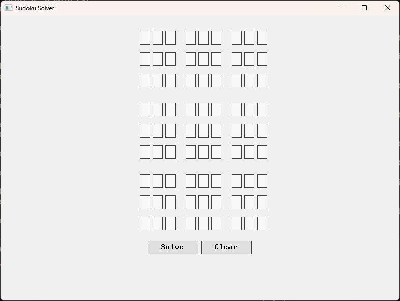

# Luigidoku

A sudoku solver made with https://github.com/nakst/luigi

Same algorithm as in my WASM version: https://github.com/OetkenPurveyorOfCode/wasmodoku



## Building

Linux / Windows:

```
make RELEASE=1
```

This will create a `sudoku`/`sudoku.exe` executable respectively.


